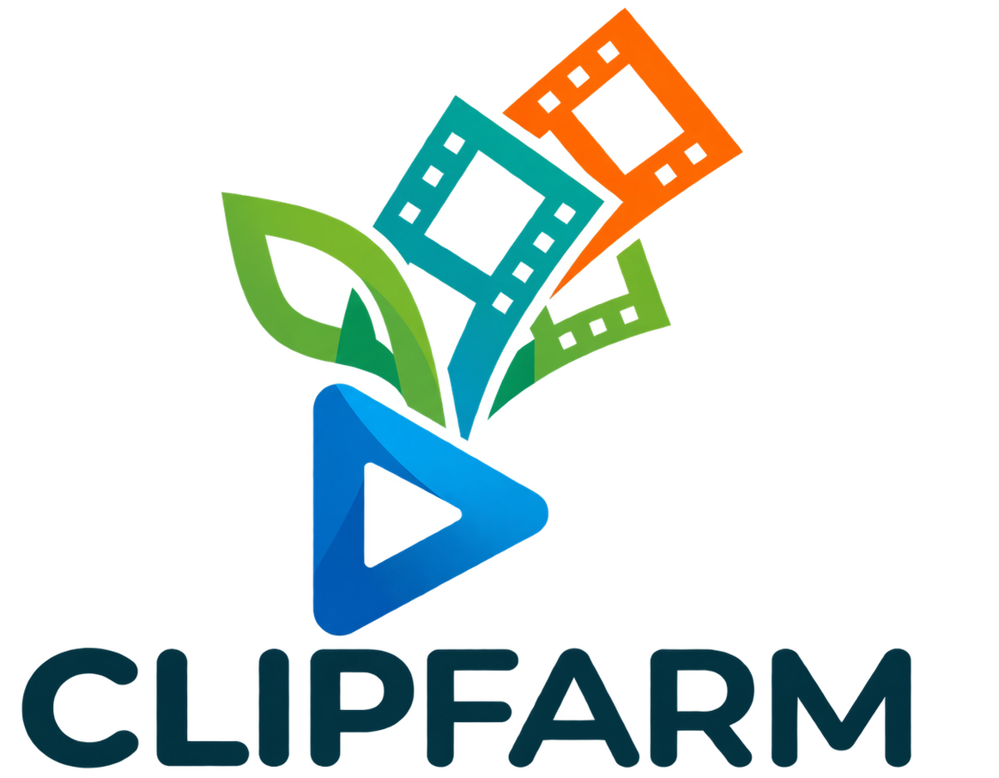

# CLIPFARM



Lokalna aplikacja desktopowa Windows do tworzenia klipów z filmów z mową.

## Uruchomienie na tym komputerze

Kliknij dwukrotnie **CLIPFARM.exe**. Launcher otwiera aplikację bez konsoli.
Alternatywy: **CLIPFARM.vbs** albo `powershell -ExecutionPolicy Bypass -File Start-CLIPFARM.ps1`.
Folder `runtime` musi pozostać obok launchera. To instalacja lokalna, a nie przenośny pojedynczy EXE.

## Instalacja ze świeżego repozytorium

Na Windows zainstaluj Python 3.12 oraz **Codex CLI albo Claude Code**. Sklonuj repozytorium i otwórz PowerShell
w jego folderze, na przykład:

```powershell
git clone <adres-repozytorium> CLIPFARM
cd CLIPFARM
powershell -ExecutionPolicy Bypass -File .\Install-CLIPFARM.ps1
codex login                 # jeśli używasz Codex CLI
# albo:
npm install -g @anthropic-ai/claude-code
claude                       # dokończ logowanie w terminalu
```

Instalator tworzy lokalne środowisko `runtime` i pobiera biblioteki. Potem uruchom:

```powershell
powershell -ExecutionPolicy Bypass -File .\Start-CLIPFARM.ps1
```

Przy kolejnych uruchomieniach wystarczy dwuklik `CLIPFARM.exe` albo `CLIPFARM.vbs`.
Nie przenoś samego pliku EXE — musi mieć obok `app.py`, `assets`, `models` i `runtime`.
Jeśli PowerShell zgłosi brak Pythona, zainstaluj Python 3.12 z opcją „Add python.exe to PATH”,
zamknij i otwórz PowerShell ponownie, a następnie uruchom instalator jeszcze raz.

CLIPFARM wykrywa dostawcę automatycznie: najpierw sprawdza Codex CLI, a jeśli nie może
z niego skorzystać, przechodzi do Claude Code. Na komputerze z oboma narzędziami Codex
ma pierwszeństwo. Użytkownik Claude nie musi instalować Codexa — wystarczy `claude`,
jednorazowe logowanie w terminalu i później zwykły start aplikacji.

1. Przeciągnij film z Eksploratora Windows na pole „Zacznij od filmu” albo kliknij „Dodaj film”.
2. Domyślne ustawienia: pięć propozycji, długość 30–60 s, pionowy obraz 9:16,
   cały film z czarnymi pasami i napisy w obrazie.
3. Kliknij „Znajdź fragmenty”. Whisper robi transkrypcję lokalnie, jeśli nie ma gotowej;
   Codex CLI wysyła tekst do GPT 6.1 Sol i zwraca tytuły, czasy i uzasadnienia.
4. Popraw czasy w sekundach i obejrzyj fragment w systemowym odtwarzaczu.
5. Zaznacz klipy i kliknij „Eksportuj zaznaczone”. Wybierz folder docelowy.

Obok trybu AI dostępny jest tryb „Film · minuty”. Dzieli cały materiał na kolejne
60-sekundowe części (ostatnia może być krótsza), bez wybierania momentów przez model.
Przed napisami można włączyć dodatki eksportu: lekki kolor, tempo 1,1× i odbicie lustrzane.
Ustawienia zapisują się razem z projektem, a napisy są globalnie większe o 2 punkty.

Każdy eksport zawiera MP4, osobny SRT i manifest `clips.json`.
Projekty można zapisać do JSON i wczytać ponownie. Film źródłowy musi nadal istnieć.
Transkrypcje są zapamiętywane w `projects` z identyfikacją ścieżki, rozmiaru i daty pliku.
Modele Whisper są w `models`. Gotowa transkrypcja jest używana ponownie przy wyborze klipów.

## Kadrowanie i ponowne użycie transkrypcji

„Cały obraz · czarne pasy” dopasowuje cały film do 1080×1920 bez obcinania boków.
Dla poziomego filmu pasy pojawiają się u góry i u dołu. „Wypełnij · środek” przycina obraz,
a „Podążaj za twarzą” używa lokalnego YuNet / OpenCV do przesuwania pionowego kadru.
Przy wielu osobach wybierana jest duża twarz z preferencją zachowania ciągłości.
Gdy w całym klipie nie wykryto twarzy, eksport zachowuje cały obraz z pasami.
Po chwilowym zniknięciu twarzy kadr pozostaje w ostatnim położeniu.
Podgląd i eksport używają tego samego trybu. Oryginalny format zachowuje proporcje filmu.

Obok filmu dostępne są trzy działania:

- „Transkrybuj”: tworzy samą lokalną transkrypcję, bez wywoływania GPT.
- „Wczytaj”: dołącza SRT, VTT lub JSON z listą `segments` (start, end, text).
- „Pobierz”: zapisuje pełną transkrypcję filmu do SRT albo JSON.

Jeżeli `film.mp4` ma obok `film.srt`, `film.vtt`, `film.transcript.json` lub `film.json`,
aplikacja może wczytać je automatycznie. Pierwszeństwo ma prawidłowa lokalna pamięć transkrypcji
dla tego samego pliku. Można zastąpić ją ręcznie przyciskiem „Wczytaj”.
Wczytana transkrypcja jest zapamiętywana. Ponowny wybór klipów używa gotowego tekstu,
a zmiana kadrowania wymaga tylko ponownego eksportu; nie wymaga ani Whispera, ani Codexa.
Ponowny wybór innych momentów wywołuje Codex, ale nie powtarza transkrypcji.

## Sprzęt i konto

Przetestowano na NVIDIA RTX 4070 12 GB: Whisper small / CUDA float16 oraz H.264 NVENC.
Biblioteki NVIDIA zostały zainstalowane wewnątrz środowiska aplikacji, bez zmiany sterowników.
Przy niedostępnej akceleracji tryb automatyczny próbuje użyć CPU i informuje o tym w dzienniku.
Pierwsze użycie innego modelu Whisper może pobrać go z Hugging Face.

Aplikacja automatycznie wykrywa zalogowane narzędzie AI. Jeśli istnieje Codex CLI,
używa jego konta i GPT 6.1 Sol. Jeśli Codex nie jest dostępny, a istnieje Claude Code,
używa jego aktywnej sesji i domyślnego modelu Claude. Nie ma przełącznika dostawcy
ani klucza API. Przy problemie z logowaniem uruchom `codex login` albo `claude`.
Tokeny logowania zostają w ich własnych aplikacjach; CLIPFARM ich nie kopiuje.

Film oraz dźwięk pozostają na komputerze. Do modelu trafia transkrypcja i opis wyboru.
W długich filmach analizowane są wszystkie części transkrypcji; podział ma nakładkę,
aby nie gubić fragmentów na granicach. Wyniki są sortowane według oceny modelu,
sprawdzane względem czasu filmu i wybierane bez nakładania się.

Wybór korzysta teraz z logiki zaadaptowanej z AI-Youtube-Shorts-Generator:
ocenia mocny początek, emocje, wyrazistą opinię, odkrycie, konflikt, cytowalność,
puentę i praktyczną wartość. Model uwzględnia rodzaj materiału oraz gęstość informacji.
Tworzy do dwukrotności żądanej liczby kandydatów (maks. 40, z limitem wynikającym
z długości materiału), a aplikacja wybiera najlepsze różne fragmenty. Odrzuca
nakładające się momenty i powtarzające się zdania otwierające.
Pole `hook_sentence` zapisuje cytat otwierający w projekcie i manifeście eksportu;
cytat nieobecny w początkowej transkrypcji fragmentu jest usuwany. Ocena 0–100
jest opinią modelu, nie prognozą rzeczywistych statystyk. Długość wybrana przez
użytkownika nadal ma pierwszeństwo. Licencja i autor: THIRD_PARTY_NOTICES.md.

## Granice pierwszej wersji

- Wybór momentów odbywa się na podstawie mowy. Lokalne wykrywanie twarzy służy kadrowaniu.
- Wykrywanie twarzy nie ustala, kto mówi; przy wielu osobach sprawdź wynik podglądu.
- Napisy w klipach to krótkie frazy do 4 słów, wielkimi literami, czcionką Anton.
  W trybie całego obrazu pojawiają się na dolnym czarnym pasie; jeśli pas jest za mały,
  aplikacja rezerwuje miejsce pod obrazem. Tryby wypełnienia i twarzy mają napisy w dolnej części kadru.
  Słowa dochodzą kolejno w grupie do 4 słów, a aktualnie wypowiadane słowo jest żółte.
  Nowe transkrypcje zapisują czasy słów w JSON. Starsze transkrypcje i SRT są dopasowywane
  do dźwięku lokalnie przez Whisper / CTranslate2, bez zmiany tekstu i bez wywołania Codexa.
  Dopasowanie obejmuje segmenty wybranych klipów; czasy zapisują się do ponownego użycia.
  Synchronizacja jest automatyczna, jej dokładność zależy od dźwięku i poprawności transkrypcji.
  SRT eksportu również pokazuje słowa kolejno. Przy napisach w obrazie ma końcówkę
  `.captions.srt`, żeby odtwarzacz nie nakładał drugiego zestawu napisów automatycznie.
  Podgląd stosuje te same ustawienia napisów co eksport. Pełna pobierana transkrypcja pozostaje zachowana.
- „Obejrzyj fragment” tworzy lokalny plik podglądu i otwiera systemowy odtwarzacz.
- Przerwanie transkrypcji następuje po bieżącym segmencie; ładowanie modelu może potrwać.
- Model może zwrócić mniej klipów niż zamówiono, gdy materiał nie spełnia kryteriów.

## Ponowna instalacja / rozwój

Python 3.12 zalecany. Uruchom `Install-CLIPFARM.ps1`, a następnie zaloguj Codex CLI.
Zależności są przypięte w `requirements.txt`, w tym PyAV 16.1 zgodne z faster-whisper 1.2.1.
Kod: `app.py` (obsługa okna), `ui_layout.py` (interfejs), `ui_media.py` (lokalne miniatury),
`engine.py` (pipeline), `framing.py` (kadrowanie), `transcripts.py` (napisy i pamięć), `Launcher.cs` (launcher).

Interfejs ma jasny wygląd inspirowany aplikacjami Apple. Kliknięcie miniatury klipu otwiera
podgląd w systemowym odtwarzaczu. Dziennik techniczny jest pod przyciskiem „Szczegóły”.
Skróty: Ctrl+O — wybór filmu, Ctrl+S — zapis projektu, Escape — przerwanie zadania.

Weryfikacja: `check_pipeline.py` sprawdza eksport NVENC, audio, proporcje i napisy
na wygenerowanym materiale. `check_voice.ps1` generuje głos testowy przy użyciu Windows.
`check_e2e.py` uruchamia pełny przepływ; używa sieci, pobiera Whisper i zużywa limit konta Codex.
Zapisany wynik testu jest w `checks/e2e/result.json`.
`checks/framing_review.py` sprawdza pasy, ruch twarzy i brak twarzy na lokalnym materiale;
`checks/transcript_review.py` sprawdza zapis i import, cache oraz ponowny wybór z zabronionym
uruchomieniem Whispera. Te testy nie wywołują Codexa.

Model twarzy: [OpenCV YuNet](https://github.com/opencv/opencv_zoo/tree/main/models/face_detection_yunet).
Model jest dołączony w `assets/face/yunet.onnx`, z licencją MIT w `assets/face/LICENSE`.

Źródła integracji: [OpenAI Docs — GPT 6.1 Sol](https://developers.openai.com/api/docs/models/gpt-6.1-sol),
[Codex CLI](https://learn.chatgpt.com/docs/developer-commands?surface=cli),
[faster-whisper](https://github.com/SYSTRAN/faster-whisper).
